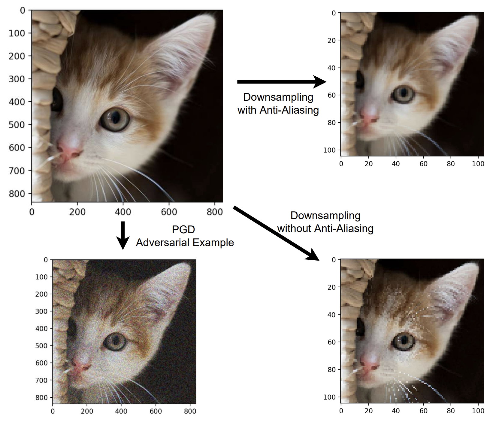

{{ page.authors }}

## Abstract 

Many commonly well-performing convolutional neural network models have shown to be susceptible to input data perturbations, indicating a low model robustness. Adversarial attacks are thereby specifically optimized to reveal model weaknesses, by generating small, barely perceivable image perturbations that flip the model prediction. Robustness against attacks can be gained for example by using adversarial examples during training, which effectively reduces the measurable model attackability. In contrast, research on analyzing the source of a model’s vulnerability is scarce. In this paper, we analyze adversarially trained, robust models in the context of a specifically suspicious network operation, the downsampling layer, and provide evidence that robust models have learned to downsample more accurately and suffer significantly less from aliasing than baseline models.

## Resources

<a href=" {{ page.paperurl }} ">[pdf]</a> <a href=" {{ page.arxiv }} ">[arxiv]</a> <a href=" {{ page.code }} ">[github]</a> <a href=" {{ page.video }} ">[video]</a> <a href=" {{ page.poster }} ">[video]</a>

## Bibtex 
 
  @inproceedings{
  grabinski2022aliasing,
  title={Aliasing coincides with {CNN}s vulnerability towards adversarial attacks},
  author={Julia Grabinski and Janis Keuper and Margret Keuper},
  booktitle={The AAAI-22 Workshop on Adversarial Machine Learning and Beyond},
  year={2022},
  url={https://openreview.net/forum?id=vKc1mLxBebP}
  }
