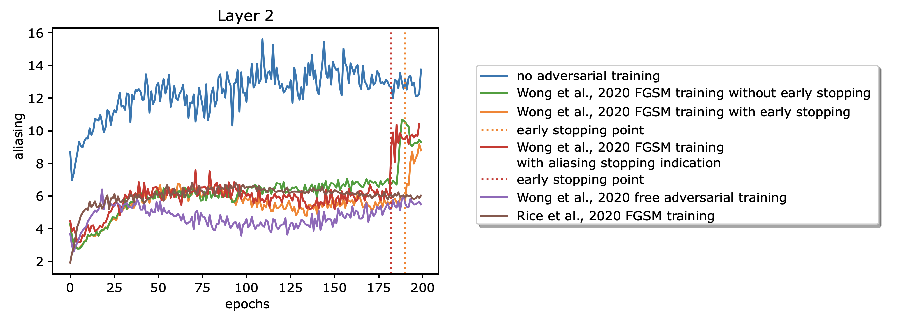

{{ page.authors }}

## Abstract 

Many commonly well-performing convolutional neural network models have shown to be susceptible to input data perturbations, indicating a low model robustness. To reveal model weaknesses, adversarial attacks are specifically optimized to generate small, barely perceivable image perturbations that flip the model prediction. Robustness against attacks can be gained by using adversarial examples during training, which in most cases reduces the measurable model attackability. Unfortunately, this technique can lead to robust overfitting, which results in non-robust models. In this paper, we analyze adversarially trained, robust models in the context of a specific network operation, the downsampling layer, and provide evidence that robust models have learned to downsample more accurately and suffer significantly less from downsampling artifacts, aka. aliasing, than baseline models. In the case of robust overfitting, we observe a strong increase in aliasing and propose a novel early stopping approach based on the measurement of aliasing.

## Resources

<a href=" {{ page.paperurl }} ">[pdf]</a> <a href=" {{ page.arxiv }} ">[arxiv]</a> <a href=" {{ page.code }} ">[github]</a> <a href=" {{ page.video }} ">[video]</a> <a href=" {{ page.poster }} ">[video]</a>

## Bibtex 
 
  @article{grabinski2022aliasing,
    title={Aliasing and adversarial robust generalization of cnns},
    author={Grabinski, Julia and Keuper, Janis and Keuper, Margret},
    journal={Machine Learning},
    volume={111},
    number={11},
    pages={3925--3951},
    year={2022},
    publisher={Springer}
  }
