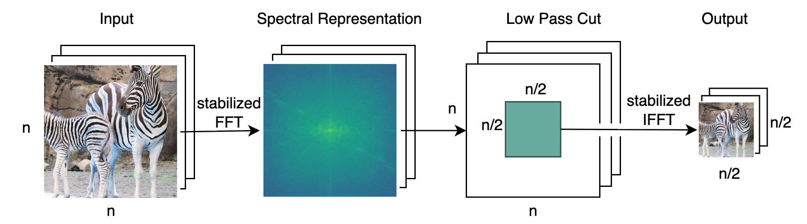

{{ page.authors }}

## Abstract 

Over the last years, Convolutional Neural Networks (CNNs) have been the dominating neural architecture in a wide range of computer vision tasks. From an image and signal processing point of view, this success might be a bit surprising as the inherent spatial pyramid design of most CNNs is apparently violating basic signal processing laws, i.e. Sampling Theorem in their down-sampling operations. However, since poor sampling appeared not to affect model accuracy, this issue has been broadly neglected until model robustness started to receive more attention. Recent work in the context of adversarial attacks and distribution shifts, showed after all, that there is a strong correlation between the vulnerability of CNNs and aliasing artifacts induced by poor down-sampling operations. This paper builds on these findings and introduces an aliasing free down-sampling operation which can easily be plugged into any CNN architecture: FrequencyLowCut pooling. Our experiments show, that in combination with simple and fast FGSM adversarial training, our hyper-parameter free operator significantly improves model robustness and avoids catastrophic overfitting.

## Resources

<a href=" {{ page.paperurl }} ">[pdf]</a> <a href=" {{ page.arxiv }} ">[arxiv]</a> <a href=" {{ page.code }} ">[github]</a> <a href=" {{ page.video }} ">[video]</a> <a href=" {{ page.poster }} ">[video]</a>

## Bibtex 
 
  @inproceedings{
    grabinski2022frequencylowcut,
    title={Frequencylowcut pooling-plug and play against catastrophic overfitting},
    author={Grabinski, Julia and Jung, Steffen and Keuper, Janis and Keuper, Margret},
    booktitle={European Conference on Computer Vision},
    pages={36--57},
    year={2022},
    organization={Springer}
  }

