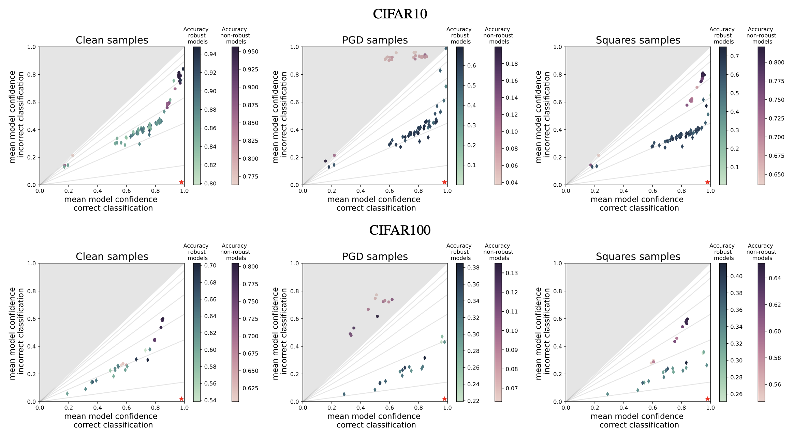

{{ page.authors }}

## Abstract 

Despite the success of convolutional neural networks (CNNs) in many academic benchmarks for computer vision tasks, their application in the real-world is still facing fundamental challenges. One of these open problems is the inherent lack of robustness, unveiled by the striking effectiveness of adversarial attacks. Current attack methods are able to manipulate the network’s prediction by adding specific but small amounts of noise to the input. In turn, adversarial training (AT) aims to achieve robustness against such attacks and ideally a better model generalization ability by including adversarial samples in the trainingset. However, an in-depth analysis of the resulting robust models beyond adversarial robustness is still pending. In this paper, we empirically analyze a variety of adversarially trained models that achieve high robust accuracies when facing state-of-the-art attacks and we show that AT has an interesting side-effect: it leads to models that are significantly less overconfident with their decisions, even on clean data than non-robust models. Further, our analysis of robust models shows that not only AT but also the model’s building blocks (like activation functions and pooling) have a strong influence on the models’ prediction confidences.

## Resources

<a href=" {{ page.paperurl }} ">[pdf]</a> <a href=" {{ page.arxiv }} ">[arxiv]</a> <a href=" {{ page.code }} ">[github]</a> <a href=" {{ page.video }} ">[video]</a> <a href=" {{ page.poster }} ">[video]</a>

## Bibtex 
 
  @inproceedings{
  grabinski2022robust,
  title={Robust Models are less Over-Confident},
  author={Julia Grabinski and Paul Gavrikov and Janis Keuper and Margret Keuper},
  booktitle={Advances in Neural Information Processing Systems},
  editor={Alice H. Oh and Alekh Agarwal and Danielle Belgrave and Kyunghyun Cho},
  year={2022},
  url={https://openreview.net/forum?id=5K3uopkizS}
  }
