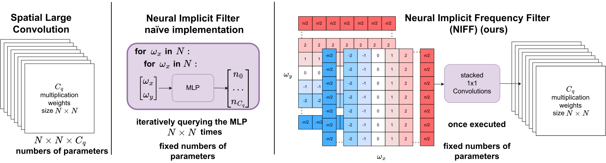

{{ page.authors }}

## Abstract 

Recent work in neural networks for image classification has seen a strong tendency towards increasing the spatial context during encoding. Whether achieved through large convolution kernels or self-attention, models scale poorly with the increased spatial context, such that the improved model accuracy often comes at significant costs. In this paper, we propose a module for studying the effective filter size of convolutional neural networks (CNNs). To facilitate such a study, several challenges need to be addressed: (i) we need an effective means to train models with large filters (potentially as large as the input data) without increasing the number of learnable parameters, (ii) the employed convolution operation should be a plug-and-play module that can replace conventional convolutions in a CNN and allow for an efficient implementation in current frameworks, (iii) the study of filter sizes has to be decoupled from other aspects such as the network width or the number of learnable parameters, and (iv) the cost of the convolution operation itself has to remain manageable i.e. we can not naïvely increase the size of the convolution kernel. To address these challenges, we propose to learn the frequency representations of filter weights as neural implicit functions, such that the better scalability of the convolution in the frequency domain can be leveraged. Additionally, due to the implementation of the proposed neural implicit function, even large and expressive spatial filters can be parameterized by only a few learnable weights. Interestingly, our analysis shows that, although the proposed networks could learn very large convolution kernels, the learned filters are well localized and relatively small in practice when transformed from the frequency to the spatial domain. We anticipate that our analysis of individually optimized filter sizes will allow for more efficient, yet effective, models in the future.

## Resources

<a href=" {{ page.paperurl }} ">[pdf]</a> <a href=" {{ page.arxiv }} ">[arxiv]</a> <a href=" {{ page.code }} ">[github]</a> <a href=" {{ page.video }} ">[video]</a> <a href=" {{ page.poster }} ">[video]</a>

## Bibtex 
 
  @inproceedings{
  grabinski2024large,
  title={As large as it gets-studying infinitely large convolutions via neural implicit frequency filters},
  author={Grabinski, Julia and Keuper, Janis and Keuper, Margret},
  journal={Transactions on Machine Learning Research},
  volume={2024},
  pages={1--42},
  year={2024},
  publisher={TMLR},
  note = {Featured Certification}
}

